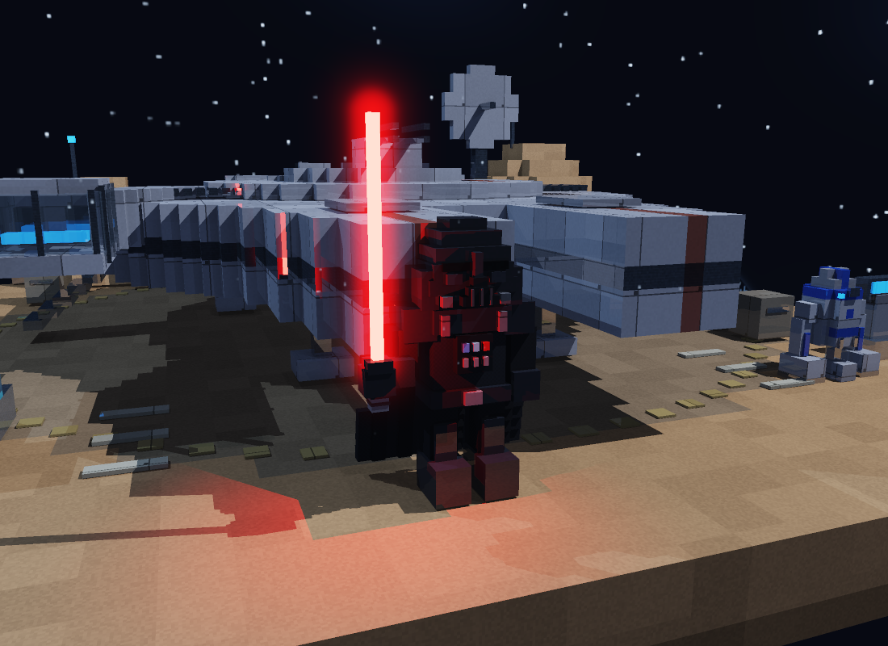
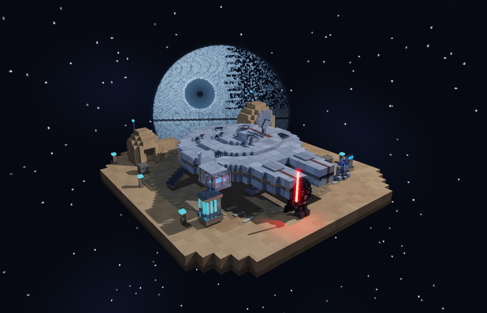
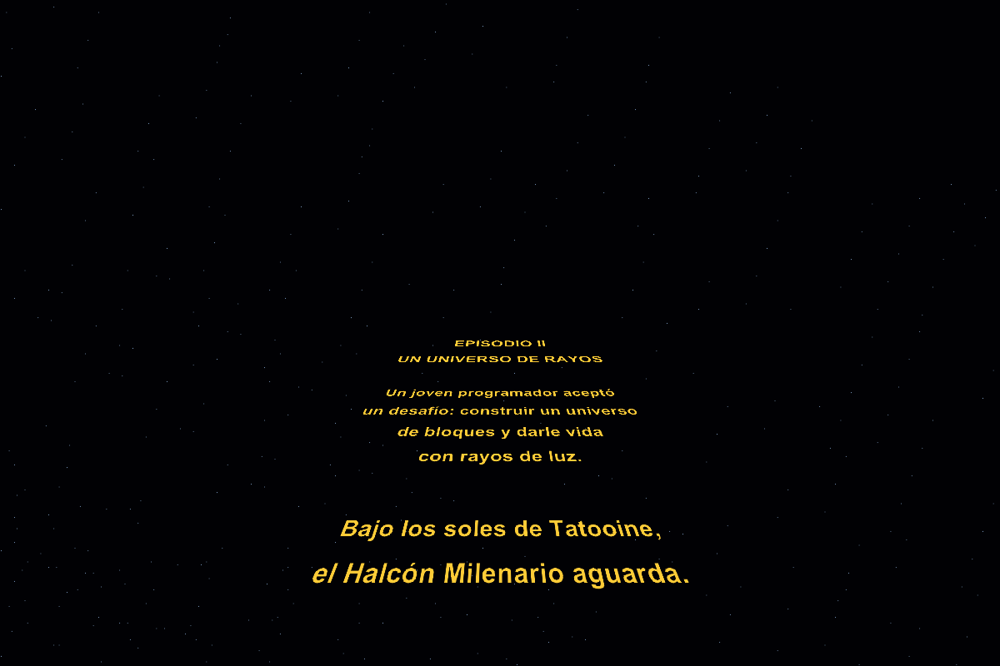

# Millennium Falcon — Docking Bay 94

Diorama de Star Wars construido con **5,814 bloques** y renderizado por raytracing
implementado desde cero en Rust y GLSL. La nave está estacionada en un pequeño puerto
espacial desértico, con edificios de arenisca, luces, carga, un depósito de cristal
un droide astromecánico junto a su estación de mantenimiento y Vader con sable rojo.

[](renders/diorama.webm)

**[▶ Ver el video del diorama](renders/diorama.webm)** — Recorrido de la versión inicial:
42 segundos, giro de 360° y acercamiento a la cabina. Las capturas muestran la
versión actual; el video todavía no incluye Vader, el cielo espacial ni la intro. El video se genera desde el propio visor, sin editores
ni paquetes adicionales. El archivo está incluido en `renders/diorama.webm`.

## Ejecutar

Requiere Rust y Cargo con soporte para la edición 2024. En macOS también se
necesitan las herramientas de compilación de Xcode y CMake para compilar raylib.

**En Mac: doble clic en `Iniciar.command`.** Compila en modo optimizado y abre una
ventana independiente. Mantener el lanzador dentro de esta carpeta. También se
puede ejecutar desde Terminal, dentro del proyecto:

```sh
cargo run --release --locked
```

Después de descargar las dependencias una vez se puede agregar `--offline`.
Usar siempre `--release` para presentar; la compilación de depuración es más lenta.
El lanzador genera una app local en `target/Millennium Falcon.app`.
`cargo run --release --offline -- --demo` inicia directamente el recorrido.
Al abrir aparece un prólogo de 26 segundos, saltable con Enter o Espacio.
Después, la ventana inicia con el **raytracer GPU**; `--cpu` permite usar el motor CPU de
respaldo. Si el shader no compila, la aplicación vuelve automáticamente a CPU.

### Controles de la ventana

| Acción | Control |
|---|---|
| Rotar alrededor del diorama | Arrastrar sobre la escena o usar las flechas |
| Acercar y alejar | Rueda/scroll del trackpad, caracteres `+` y `−` (también `=`), teclado numérico o botones `+` / `−` |
| Vista inicial | `R` o `1` |
| Motor / Cabina / Refracción / Superior / Droide | `2` / `3` / `4` / `5` / `6`, o botones superiores |
| Recorrido automático / detener | Espacio |
| Activar/desactivar reflexión | `F` |
| Activar/desactivar refracción | `G` |
| Activar/desactivar skybox | `B` |
| Nitidez durante el movimiento | `Q` o botón superior: Nítido 1200 → Fluido → Retina |
| Alternar raytracer CPU / GPU | `T` (misma cámara y efectos) |
| Vader y sable | `7` o botón Vader |
| Cambiar Tatooine / espacio | `C` |
| Repetir introducción | `I` |
| Saltar introducción / silenciar su música | Enter o Espacio / `M` |
| Mostrar/ocultar ayuda | `H` |
| Guardar imagen de calidad | `S` → `renders/captura.png`, 2560 px de ancho (mantener cámara quieta) |
| Salir | Escape o cerrar la ventana |

### Rendimiento en Mac M1

El modo GPU ejecuta un fragment shader GLSL 330 mediante raylib/OpenGL 4.1.
Cada píxel calcula sus propios rayos en paralelo. La geometría sigue siendo una
colección de bloques: el shader implementa intersecciones, texturas, iluminación,
sombras, reflexión, refracción y skybox. No utiliza un motor de raytracing externo
ni depende de aceleración de rayos dedicada del hardware.

- La escena y la BVH se cargan una sola vez en texturas RGBA32F. El recorrido
  visita primero las cajas más cercanas; las sombras terminan al encontrar un
  obstáculo opaco. La pila BVH admite 64 entradas; la construcción limita la profundidad a 60.
- La imagen permanece en GPU para presentarla; solo las capturas y las pruebas
  comparativas la leen de vuelta a CPU.
- Inicia en **Nítido 1200**, con ancho fijo durante el movimiento. `Q` cambia a
  **Fluido adaptativo** (480–1200 px en GPU), **Retina constante** (1600–2560 px)
  y regresa a Nítido. El modo Fluido busca 30 imágenes/s, sin garantizarlas.
- Todos los modos conservan los efectos. En movimiento usan una muestra por
  píxel y tres niveles de rayos secundarios. Al detenerse recuperan oclusión
  local, seis niveles y finalmente cuatro muestras por píxel a resolución Retina.
- La ventana tiene un límite de 60 FPS. Las vistas cercanas del vidrio exigen más
  rayos; para priorizar fluidez en esas vistas se puede seleccionar Fluido.
- `T` cambia a CPU sin perder encuadre ni controles. El motor CPU conserva el
  reparto por bandas de ocho filas, cancelación del refinamiento y resolución
  adaptativa de 192–640 px. No calcula imágenes en segundo plano mientras se usa GPU.
- **Imágenes/s** cuenta actualizaciones presentadas; **UI FPS** mide el ciclo de
  la ventana. El tiempo en ms corresponde al trazado en CPU y al intervalo del
  ciclo de la ventana en GPU. En reposo no se recalcula continuamente.

Para medir cuadros GPU terminados, el benchmark fuerza lectura de la textura:

```sh
cargo run --release --offline -- --benchmark-gpu --width 1200 --height 644 --quality 0
```

El resultado incluye transferencia y copia de píxeles; no mide solamente el envío
de instrucciones a la GPU. Usa tres cuadros de calentamiento y diez medidos por
vista. El encuadre gira 0.7 grados por cuadro.

Medición con Vader en Apple M1 (1200×644, calidad interactiva, Tatooine y todos los efectos activos):

| Vista | Tiempo medio, con lectura | Cuadros/s del benchmark |
|---|---:|---:|
| Principal | 15.2 ms | 65.8 |
| Motor | 24.2 ms | 41.4 |
| Cabina | 64.7 ms | 15.4 |
| Refracción | 44.8 ms | 22.3 |
| Superior | 14.3 ms | 69.7 |
| Droide | 23.6 ms | 42.4 |
| Vader | 32.6 ms | 30.7 |

Estas cifras son una medición, no un mínimo garantizado. Cambian con el encuadre
y la carga del equipo; la ventana limita la presentación a 60 FPS. En vidrio,
Nítido 1200 conserva resolución y puede quedar por debajo de 30 FPS.

### Motor CPU de respaldo

Comparación de CPU a 1200×644, todos los efectos activos y calidad interactiva:

| Vista | Versión inicial | BVH optimizada | Reducción de tiempo |
|---|---:|---:|---:|
| Principal | 115 ms | 70 ms | 39 % |
| Cabina | 750 ms | 360 ms | 52 % |

Medianas de cuatro ejecuciones por versión, alternadas en el mismo Apple M1 para
reducir el efecto de cambios de carga. La búsqueda optimizada utiliza una jerarquía
construida por superficie y cantidad de bloques (SAH), índices de hojas contiguos,
inversas de dirección precalculadas y distancias de cajas reutilizadas durante el
recorrido. No reduce resolución, muestras, materiales ni profundidad de los rayos.

Los tiempos corresponden al trazado en CPU, sin codificación PNG ni presentación.
Varían con el encuadre y la carga del sistema. Las vistas del vidrio aún son
costosas; Retina constante prioriza detalle y no garantiza movimiento fluido.

```sh
cargo run --release --offline -- --benchmark-sharp
cargo run --release --offline -- --benchmark
```

## Cumplimiento de la rúbrica

| Apartado | Implementación y evidencia |
|---|---|
| Complejidad (30, subjetivo) | Casco circular escalonado, dos mandíbulas, pasillo y cabina lateral, antena, torreta con cuatro cañones, seis ventiladores, soportes de aterrizaje, rampa, edificios, carga, droide con estación de mantenimiento y Vader con capa y sable. |
| Atractivo visual (20, subjetivo) | Composición sobre base finita, materiales con textura, luz cálida y de relleno, sombras, oclusión local y suavizado de bordes. |
| Rotación y zoom (20) | Cámara orbital interactiva alrededor de un objetivo, control de azimut, elevación y distancia. Se recalculan los rayos al moverla. |
| Materiales (hasta 25) | Cinco materiales base más tres superficies para Vader; cada uno con textura y parámetros de albedo, especular, transparencia y reflectividad. Tabla siguiente. |
| Refracción (10) | Ley de Snell, índice 1.5 para vidrio, interfaces de entrada y salida, reflexión interna total. Vidrio en cabina y depósito; su interior permite observar el desplazamiento óptico. |
| Reflexión (5) | Rayos secundarios reflejados en metal pulido y vidrio, con mezcla de Fresnel para el material transparente. |
| Skybox (20) | Cubemap de seis caras, muestreo por dirección y filtrado bilineal. Entornos intercambiables: desierto con dos soles y espacio con estrellas y estación parcialmente destruida, visibles también en reflejos. |
| Entrega | Código fuente, capturas y video incluidos en el repositorio. |

## Iluminación y presentación

Una luz principal cálida define el volumen y una luz de relleno azul conserva
los detalles de las caras en sombra. La exposición y la luz ambiente se ajustan
para distinguir paneles del casco, ventiladores y pasillo lateral. La plataforma
central tiene un tono más oscuro que la arena exterior y el motor mantiene una
banda azul emisiva. La escena contiene 5,814 bloques y tres luces: dos generales y una roja de alcance limitado junto al sable.

## Zona de mantenimiento

El astromecánico tiene cuerpo blanco con paneles azules, cúpula escalonada,
sensor frontal, patas laterales y tercer apoyo. Una consola con pantalla luminosa
y cable sobre la plataforma completa el área de servicio. Las piezas usan los
materiales existentes; no se añaden luces ni cálculos ópticos nuevos.

La tecla **6** abre una vista cercana. Desde ahí también se puede rotar y usar zoom.


## Vader, sable y entorno espacial

La vista **7** muestra el casco escalonado, respirador, panel del pecho, capa con
pliegues, botas y empuñadura estriada. La tela y la armadura tienen respuestas
ópticas distintas. El sable contiene bloques emisivos y un halo analítico
recortado por la distancia al primer impacto; la luz roja local utiliza sombras
y atenúa su intensidad hasta cero a tres unidades. El halo es un efecto artístico,
no una simulación de dispersión volumétrica ni iluminación global.



**C** cambia de entorno. El cielo espacial se genera por código en un cubemap de
768 píxeles por cara, con estrellas y una estación de combate parcialmente
destruida. No añade bloques a la BVH. Su iluminación de relleno es más fría.
El cielo de Tatooine se conserva y **B** permite desactivar cualquiera de ellos.



## Introducción

El prólogo presenta un texto original sobre un joven programador, seguido por
letras amarillas que se alejan en perspectiva. Termina con un fundido y la entrada
al diorama. **Enter/Espacio** lo salta, **I** lo repite y `--no-intro` abre
directamente la escena. El texto utiliza una fuente del sistema cuando está
disponible y la fuente integrada de raylib como alternativa; no se distribuyen
fuentes externas. La introducción pertenece a la presentación nativa.



La música es opcional: colocar una grabación autorizada en `assets/audio/intro.ogg`,
`intro.mp3` o `intro.wav`. Se reproduce con raylib, **M** silencia y se detiene al
terminar o saltar la intro. No se incluye una grabación musical en el repositorio;
los archivos locales de audio están excluidos de Git. Sin archivo, la intro
funciona en silencio.

Los tres materiales de Vader enriquecen el aspecto visual; la rúbrica limita la
puntuación por materiales a cinco, aunque la escena incluya ocho.

## Materiales

Los colores se calculan en espacio lineal. Los valores RGB de albedo están entre
0 y 1. Un cero en transparencia o reflectividad es intencional para materiales
opacos o mates. Las variantes de color del casco no se cuentan como materiales extra.

| Material | Textura propia | Albedo RGB | Especular / exponente | Transparencia | Reflectividad | IOR |
|---|---|---|---|---|---|---|
| Aleación del casco | Paneles, uniones, pernos y desgaste | 0.58, 0.61, 0.64 | 0.38 / 55 | 0 | 0.10 | 1.0 |
| Metal oscuro pulido | Estrías y grano de metal | 0.105, 0.14, 0.17 | 0.80 / 120 | 0 | 0.42 | 1.0 |
| Vidrio de cabina | Variación superficial fina con tinte azulado | 0.63, 0.83, 0.90 | 0.95 / 180 | 0.86 | 0.08 | 1.5 |
| Arenisca | Grano y variación por bloque | 0.61, 0.39, 0.20 | 0.06 / 12 | 0 | 0 | 1.0 |
| Paneles del motor | Franjas y celdas luminosas | 0.12, 0.66, 0.95 | 0.65 / 85 | 0 | 0.16 | 1.0 |
| Tejido de la capa | Trama de fibras | 0.022, 0.027, 0.038 | 0.09 / 8 | 0 | 0.01 | 1.0 |
| Armadura negra | Acabado fino con grano | 0.045, 0.052, 0.068 | 0.65 / 180 | 0 | 0.09 | 1.0 |
| Plasma del sable | Bandas de energía | 1.0, 0.035, 0.018 | 0.20 / 60 | 0 | 0.02 | 1.0 |

Las ocho texturas son procedurales y deterministas: se generan por código, con
muestreo de coordenadas de cada cara. El motor además tiene emisión para dar
apariencia luminosa; no se simula iluminación global por emisión.


### Comparación de refracción

| Activada | Desactivada |
|---|---|
|  |  |

## Dependencias

La única dependencia directa es **raylib 6**, utilizada para ventana, entrada, audio opcional,
texto, ejecución del shader propio y presentación de la imagen. Sus dependencias transitivas quedan registradas
en `Cargo.lock`.

**Rust estándar** construye geometría, materiales, cámara, cubemap y BVH; también
implementa el raytracer CPU paralelo y el codificador PNG. **GLSL** implementa el
raytracer GPU con los mismos parámetros. Reflexión y refracción usan una pila
iterativa acotada en el shader, equivalente a la recursión del motor CPU.
No se utilizan motores 3D ni librerías matemáticas o de trazado de rayos.

Se conserva un visor web **opcional**, útil para grabar el video con Canvas 2D y
MediaRecorder nativos. No es necesario para presentar en la ventana:

```sh
cargo run --release --offline -- --web
```

Abrir `http://127.0.0.1:7878`. El servidor solo escucha localmente; `Ctrl+C` lo
cierra. `--port 7879` permite elegir otro puerto. El navegador muestra los píxeles
calculados por Rust y graba solo su canvas, sin cámara ni micrófono.

## Renderizar sin navegador

```sh
cargo run --release --offline -- --render
```

Este comando usa CPU y produce `renders/falcon.png`. Para exportar con GPU:

```sh
cargo run --release --offline -- --gpu-check --width 1600 --height 1050 --quality 2 --output renders/gpu-check.png
```

La exportación GPU requiere una sesión gráfica aunque la ventana de prueba esté
oculta. Ambos motores aceptan los mismos parámetros de cámara y efectos.
 Se pueden ajustar resolución, calidad y cámara:

```sh
cargo run --release --offline -- --render --width 1600 --height 1050 --quality 2 --yaw 38 --pitch 22 --distance 25 --output renders/falcon-hd.png
```

`--quality 0`: rápida; `1`: equilibrada; `2`: cuatro muestras por píxel.
`--tx`, `--ty` y `--tz` cambian el punto que mira la cámara.
`--no-reflections`, `--no-refractions` y `--no-skybox` permiten comparar efectos.

Para exportar las seis texturas del skybox:

```sh
cargo run --release --offline -- --render --skybox
```

Las caras `skybox-0.png` a `skybox-5.png` corresponden a +X, −X, +Y, −Y, +Z y −Z.
Para exportar un recorrido como secuencia PNG:

```sh
cargo run --release --offline -- --tour 120 --width 720 --height 470 --quality 1
```

En el visor web opcional, el botón **Grabar video del diorama** crea directamente `renders/diorama.webm`.
Si un navegador no admite WebM/MediaRecorder, el resto del visor sigue funcionando;
la grabación requiere uno que sí los admita.

## Cómo funciona

1. Se construyen cubos y prismas para la nave y el puerto. Una jerarquía de cajas
   envolventes (BVH) construida con SAH reduce las intersecciones necesarias por
   rayo y recorre primero las cajas más cercanas.
2. La cámara orbital genera rayos en perspectiva. Se toma el impacto positivo
   más cercano mediante el método de intervalos por eje.
3. Se muestrea la textura del material en la cara alcanzada y se calcula luz
   ambiente, difusa y especular. Rayos hacia las luces producen sombras, con
   transmisión aproximada a través del vidrio.
4. Se generan rayos secundarios para reflexión y refracción. Fresnel distribuye
   la parte transparente entre ambos efectos. La profundidad y la
   contribución se limitan para controlar el tiempo de render. En GPU se usa una
   pila explícita, con un máximo de 127 tareas para seis niveles secundarios.
5. Los rayos que no tocan objetos muestrean el cubemap. La imagen final recibe
   mapeo de tonos y corrección gamma, y se presenta directamente en raylib. La exportación PNG utiliza código propio.

`src/scene.rs` construye el diorama; `material.rs` define superficies;
`geometry.rs` contiene cajas y BVH; `render.rs` traza los rayos;
`camera.rs` maneja la cámara; `skybox.rs` genera y muestrea el cubemap;
`png.rs` codifica la imagen; `viewer.rs` contiene la ventana, el renderizado
asíncrono y la resolución adaptativa; `gpu.rs` carga los datos y el shader;
`shaders/raytrace.fs` calcula la imagen GPU; `intro.rs` y `shaders/crawl.fs` muestran el prólogo; `server.rs` conserva el visor web opcional.

## Verificar

```sh
cargo test --offline
cargo clippy --offline --all-targets -- -D warnings
cargo tree --offline
cargo run --release --offline -- --validate-gpu
```

Las pruebas cubren Snell, reflexión interna total, entrada/salida del vidrio,
rayos dentro y fuera de cajas, equivalencia BVH/búsqueda completa, cámara orbital,
continuidad del cubemap, límites físicos de los materiales y cancelación/reanudación
del renderizado. También comparan la jerarquía con una búsqueda exhaustiva en
la escena completa: rayos paralelos, impactos rasantes, orígenes dentro de bloques,
límites de distancia y geometría coincidente. La prueba de empaquetado verifica
que la BVH exportada para GPU conserva todos los bloques y los impactos.

`--validate-gpu` necesita un contexto gráfico y compara 42 imágenes: siete vistas,
calidad interactiva/final, los tres efectos desactivados por separado y el cielo espacial. Informa
error medio por canal y proporción de píxeles con diferencia mayor que 32/255.
La tolerancia es error medio ≤1/255 y como máximo 0.5 % de píxeles por encima de
ese umbral, para admitir diferencias de redondeo en aristas compartidas.

## Referencia visual

[Millennium Falcon — Star Wars Databank](https://www.starwars.com/databank/Millennium-Falcon).
Interpretación académica en bloques. Geometría, texturas y entorno generados en
este proyecto; no se incorporaron modelos ni texturas descargadas.
