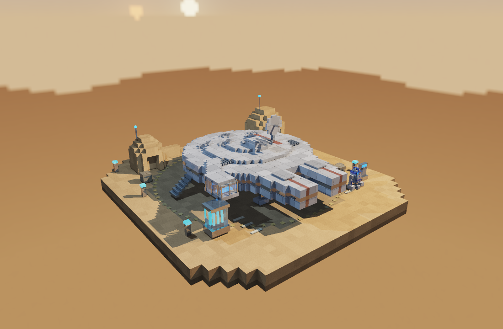
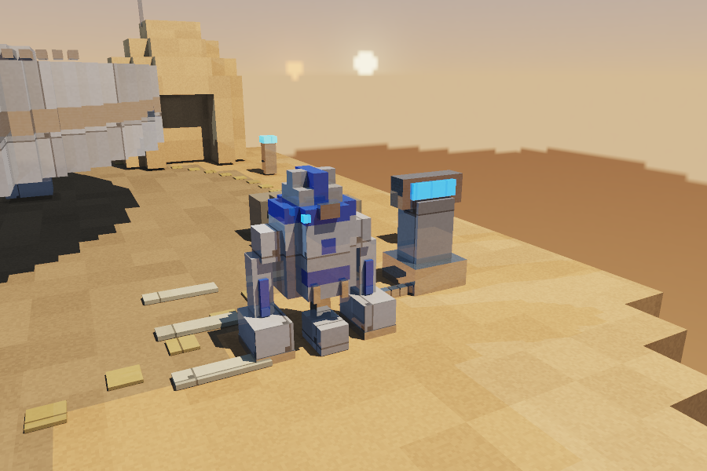
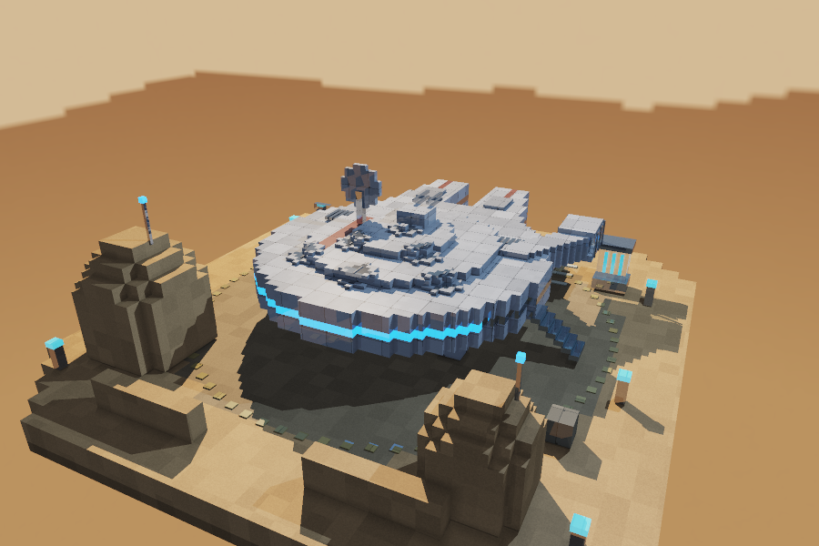
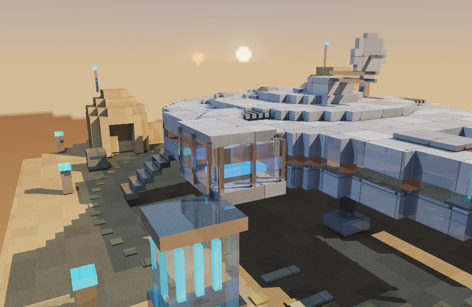
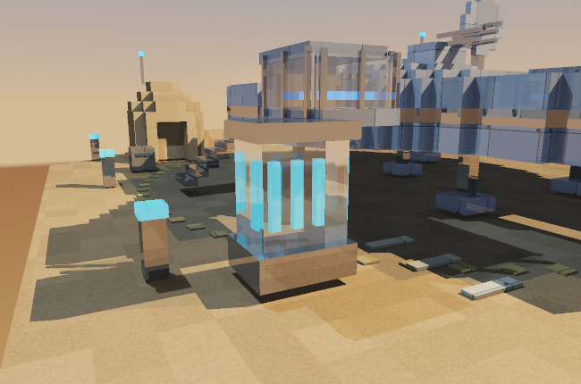
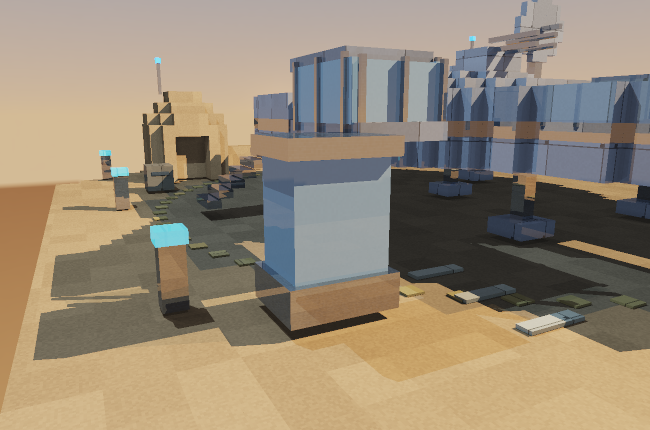

# Millennium Falcon — Docking Bay 94

Diorama de Star Wars construido con **5,596 bloques** y renderizado por raytracing
implementado desde cero en Rust. La nave está estacionada en un pequeño puerto
espacial desértico, con edificios de arenisca, luces, carga, un depósito de cristal
y un droide astromecánico junto a su estación de mantenimiento.

[](renders/diorama.webm)

**[▶ Ver el video del diorama](renders/diorama.webm)** — Recorrido de la versión inicial:
42 segundos, giro de 360° y acercamiento a la cabina. Las capturas muestran la
iluminación actualizada. El video se genera desde el propio visor, sin editores
ni paquetes adicionales. El archivo está incluido en `renders/diorama.webm`.

## Ejecutar

Requiere Rust y Cargo con soporte para la edición 2024. En macOS también se
necesitan las herramientas de compilación de Xcode y CMake para compilar raylib.

**En Mac: doble clic en `Iniciar.command`.** Compila en modo optimizado y abre una
ventana independiente. Mantener el lanzador dentro de esta carpeta. También se
puede ejecutar desde Terminal, dentro del proyecto:

```sh
cargo run --release --locked
```

Después de descargar las dependencias una vez se puede agregar `--offline`.
Usar siempre `--release` para presentar; la compilación de depuración es más lenta.
El lanzador genera una app local en `target/Millennium Falcon.app`.
`cargo run --release --offline -- --demo` inicia directamente el recorrido.

### Controles de la ventana

| Acción | Control |
|---|---|
| Rotar alrededor del diorama | Arrastrar sobre la escena o usar las flechas |
| Acercar y alejar | Rueda/scroll del trackpad, caracteres `+` y `−` (también `=`), teclado numérico o botones `+` / `−` |
| Vista inicial | `R` o `1` |
| Motor / Cabina / Refracción / Superior / Droide | `2` / `3` / `4` / `5` / `6`, o botones superiores |
| Recorrido automático / detener | Espacio |
| Activar/desactivar reflexión | `F` |
| Activar/desactivar refracción | `G` |
| Activar/desactivar skybox | `B` |
| Nitidez durante el movimiento | `Q` o botón superior: Nítido 1200 → Fluido → Retina |
| Mostrar/ocultar ayuda | `H` |
| Guardar imagen de calidad | `S` → `renders/captura.png`, 2560 px de ancho (mantener cámara quieta) |
| Salir | Escape o cerrar la ventana |

### Rendimiento en Mac M1

- Raylib recibe directamente los píxeles RGBA; no hay PNG, HTTP ni navegador en el
  camino de presentación nativo. Solo dibuja una textura 2D, no la escena 3D.
- El trazado corre en un hilo coordinador y varios trabajadores, reservando un
  núcleo lógico para la interfaz. La ventana procesa controles a 60 FPS objetivo.
- Inicia en **Nítido 1200**: mantiene 1200 píxeles de ancho al mover la cámara.
  `Q` alterna a **Fluido** (192–640 px adaptativos, objetivo 30 imágenes
  calculadas/s), después a **Retina constante** (1600–2560 px) y regresa a Nítido.
- Los tres modos conservan reflejos, refracción, sombras y cielo. En movimiento
  usan una muestra por píxel y menor profundidad recursiva; al detenerse recuperan
  oclusión local y cuatro muestras por píxel. Resolución constante no significa
  igual muestreo que una captura final.
- `--adaptive` permite iniciar directamente en Fluido. Los modos de resolución
  fija priorizan detalle y pueden resultar lentos, sobre todo cerca del vidrio.
- El trabajo se reparte en bandas de ocho filas: cada núcleo toma otra banda al
  terminar, aprovechando mejor los distintos núcleos del M1.
- Al detenerse, refina la iluminación y después renderiza a resolución Retina
  (1600–2560 de ancho), con cuatro muestras por píxel.
  La ventana utiliza HiDPI para evitar estirar un framebuffer de baja resolución. Mover la cámara cancela ese refinamiento por filas.
- No hay cola de movimientos antiguos: se solicita la cámara más reciente al
  terminar cada previsualización. En reposo no se recalcula continuamente.
- El pie distingue **imágenes/s** realmente presentadas de **FPS de interfaz**.
  En el modo Fluido, la resolución durante el movimiento es menor, especialmente
  cerca del vidrio.

Comparación de CPU a 1200×644, todos los efectos activos y calidad interactiva:

| Vista | Versión inicial | BVH optimizada | Reducción de tiempo |
|---|---:|---:|---:|
| Principal | 115 ms | 70 ms | 39 % |
| Cabina | 750 ms | 360 ms | 52 % |

Medianas de cuatro ejecuciones por versión, alternadas en el mismo Apple M1 para
reducir el efecto de cambios de carga. La búsqueda optimizada utiliza una jerarquía
construida por superficie y cantidad de bloques (SAH), índices de hojas contiguos,
inversas de dirección precalculadas y distancias de cajas reutilizadas durante el
recorrido. No reduce resolución, muestras, materiales ni profundidad de los rayos.

Los tiempos corresponden al trazado en CPU, sin codificación PNG ni presentación.
Varían con el encuadre y la carga del sistema. Las vistas del vidrio aún son
costosas; Retina constante prioriza detalle y no garantiza movimiento fluido.

```sh
cargo run --release --offline -- --benchmark-sharp
cargo run --release --offline -- --benchmark
```

## Cumplimiento de la rúbrica

| Apartado | Implementación y evidencia |
|---|---|
| Complejidad (30, subjetivo) | Casco circular escalonado, dos mandíbulas, pasillo y cabina lateral, antena, torreta con cuatro cañones, seis ventiladores, soportes de aterrizaje, rampa, edificios, carga y droide con estación de mantenimiento. |
| Atractivo visual (20, subjetivo) | Composición sobre base finita, materiales con textura, luz cálida y de relleno, sombras, oclusión local y suavizado de bordes. |
| Rotación y zoom (20) | Cámara orbital interactiva alrededor de un objetivo, control de azimut, elevación y distancia. Se recalculan los rayos al moverla. |
| Materiales (hasta 25) | Cinco materiales con su propia textura y parámetros de albedo, especular, transparencia y reflectividad. Tabla siguiente. |
| Refracción (10) | Ley de Snell, índice 1.5 para vidrio, interfaces de entrada y salida, reflexión interna total. Vidrio en cabina y depósito; su interior permite observar el desplazamiento óptico. |
| Reflexión (5) | Rayos reflejados recursivos en metal pulido y vidrio, con mezcla de Fresnel para el material transparente. |
| Skybox (20) | Cubemap de seis caras, muestreo por dirección y filtrado bilineal. Entorno desértico con dos soles, visible también en reflejos. |
| Entrega | Código fuente, capturas y video incluidos en el repositorio. |

## Iluminación y presentación

Una luz principal cálida define el volumen y una luz de relleno azul conserva
los detalles de las caras en sombra. La exposición y la luz ambiente se ajustan
para distinguir paneles del casco, ventiladores y pasillo lateral. La plataforma
central tiene un tono más oscuro que la arena exterior y el motor mantiene una
banda azul emisiva. La escena contiene 5,596 bloques y dos luces.

## Zona de mantenimiento

El astromecánico tiene cuerpo blanco con paneles azules, cúpula escalonada,
sensor frontal, patas laterales y tercer apoyo. Una consola con pantalla luminosa
y cable sobre la plataforma completa el área de servicio. Las piezas usan los
materiales existentes; no se añaden luces ni cálculos ópticos nuevos.

La tecla **6** abre una vista cercana. Desde ahí también se puede rotar y usar zoom.



## Cinco materiales

Los colores se calculan en espacio lineal. Los valores RGB de albedo están entre
0 y 1. Un cero en transparencia o reflectividad es intencional para materiales
opacos o mates. Las variantes de color del casco no se cuentan como materiales extra.

| Material | Textura propia | Albedo RGB | Especular / exponente | Transparencia | Reflectividad | IOR |
|---|---|---|---|---|---|---|
| Aleación del casco | Paneles, uniones, pernos y desgaste | 0.58, 0.61, 0.64 | 0.38 / 55 | 0 | 0.10 | 1.0 |
| Metal oscuro pulido | Estrías y grano de metal | 0.105, 0.14, 0.17 | 0.80 / 120 | 0 | 0.42 | 1.0 |
| Vidrio de cabina | Variación superficial fina con tinte azulado | 0.63, 0.83, 0.90 | 0.95 / 180 | 0.86 | 0.08 | 1.5 |
| Arenisca | Grano y variación por bloque | 0.61, 0.39, 0.20 | 0.06 / 12 | 0 | 0 | 1.0 |
| Paneles del motor | Franjas y celdas luminosas | 0.12, 0.66, 0.95 | 0.65 / 85 | 0 | 0.16 | 1.0 |

Las cinco texturas son procedurales y deterministas: se generan por código, con
muestreo de coordenadas de cada cara. El motor además tiene emisión para dar
apariencia luminosa; no se simula iluminación global por emisión.





### Comparación de refracción

| Activada | Desactivada |
|---|---|
|  |  |

## Dependencias

La única dependencia directa es **raylib 6**, utilizada para ventana, entrada,
texto y presentación de la imagen. Sus dependencias transitivas quedan registradas
en `Cargo.lock`.

**Rust estándar** implementa geometría, intersecciones, texturas, iluminación,
sombras, reflexión, refracción, cámara, cubemap, BVH, paralelismo y codificación PNG.
No se utilizan motores 3D ni librerías matemáticas o de trazado de rayos.

Se conserva un visor web **opcional**, útil para grabar el video con Canvas 2D y
MediaRecorder nativos. No es necesario para presentar en la ventana:

```sh
cargo run --release --offline -- --web
```

Abrir `http://127.0.0.1:7878`. El servidor solo escucha localmente; `Ctrl+C` lo
cierra. `--port 7879` permite elegir otro puerto. El navegador muestra los píxeles
calculados por Rust y graba solo su canvas, sin cámara ni micrófono.

## Renderizar sin navegador

```sh
cargo run --release --offline -- --render
```

Produce `renders/falcon.png`. Se pueden ajustar resolución, calidad y cámara:

```sh
cargo run --release --offline -- --render --width 1600 --height 1050 --quality 2 --yaw 38 --pitch 22 --distance 25 --output renders/falcon-hd.png
```

`--quality 0`: rápida; `1`: equilibrada; `2`: cuatro muestras por píxel.
`--tx`, `--ty` y `--tz` cambian el punto que mira la cámara.
`--no-reflections`, `--no-refractions` y `--no-skybox` permiten comparar efectos.

Para exportar las seis texturas del skybox:

```sh
cargo run --release --offline -- --render --skybox
```

Las caras `skybox-0.png` a `skybox-5.png` corresponden a +X, −X, +Y, −Y, +Z y −Z.
Para exportar un recorrido como secuencia PNG:

```sh
cargo run --release --offline -- --tour 120 --width 720 --height 470 --quality 1
```

En el visor web opcional, el botón **Grabar video del diorama** crea directamente `renders/diorama.webm`.
Si un navegador no admite WebM/MediaRecorder, el resto del visor sigue funcionando;
la grabación requiere uno que sí los admita.

## Cómo funciona

1. Se construyen cubos y prismas para la nave y el puerto. Una jerarquía de cajas
   envolventes (BVH) construida con SAH reduce las intersecciones necesarias por
   rayo y recorre primero las cajas más cercanas.
2. La cámara orbital genera rayos en perspectiva. Se toma el impacto positivo
   más cercano mediante el método de intervalos por eje.
3. Se muestrea la textura del material en la cara alcanzada y se calcula luz
   ambiente, difusa y especular. Rayos hacia las luces producen sombras, con
   transmisión aproximada a través del vidrio.
4. Se generan rayos secundarios para reflexión y refracción. Fresnel distribuye
   la parte transparente entre ambos efectos. La recursión tiene límite de
   profundidad y de contribución para controlar el tiempo de render.
5. Los rayos que no tocan objetos muestrean el cubemap. La imagen final recibe
   mapeo de tonos y corrección gamma, y se presenta directamente en raylib. La exportación PNG utiliza código propio.

`src/scene.rs` construye el diorama; `material.rs` define superficies;
`geometry.rs` contiene cajas y BVH; `render.rs` traza los rayos;
`camera.rs` maneja la cámara; `skybox.rs` genera y muestrea el cubemap;
`png.rs` codifica la imagen; `viewer.rs` contiene la ventana, el renderizado
asíncrono y la resolución adaptativa; `server.rs` conserva el visor web opcional.

## Verificar

```sh
cargo test --offline
cargo clippy --offline --all-targets -- -D warnings
cargo tree --offline
```

Las pruebas cubren Snell, reflexión interna total, entrada/salida del vidrio,
rayos dentro y fuera de cajas, equivalencia BVH/búsqueda completa, cámara orbital,
continuidad del cubemap, límites físicos de los materiales y cancelación/reanudación
del renderizado. También comparan la jerarquía con una búsqueda exhaustiva en
la escena completa: rayos paralelos, impactos rasantes, orígenes dentro de bloques,
límites de distancia y geometría coincidente.

## Referencia visual

[Millennium Falcon — Star Wars Databank](https://www.starwars.com/databank/Millennium-Falcon).
Interpretación académica en bloques. Geometría, texturas y entorno generados en
este proyecto; no se incorporaron modelos ni texturas descargadas.
